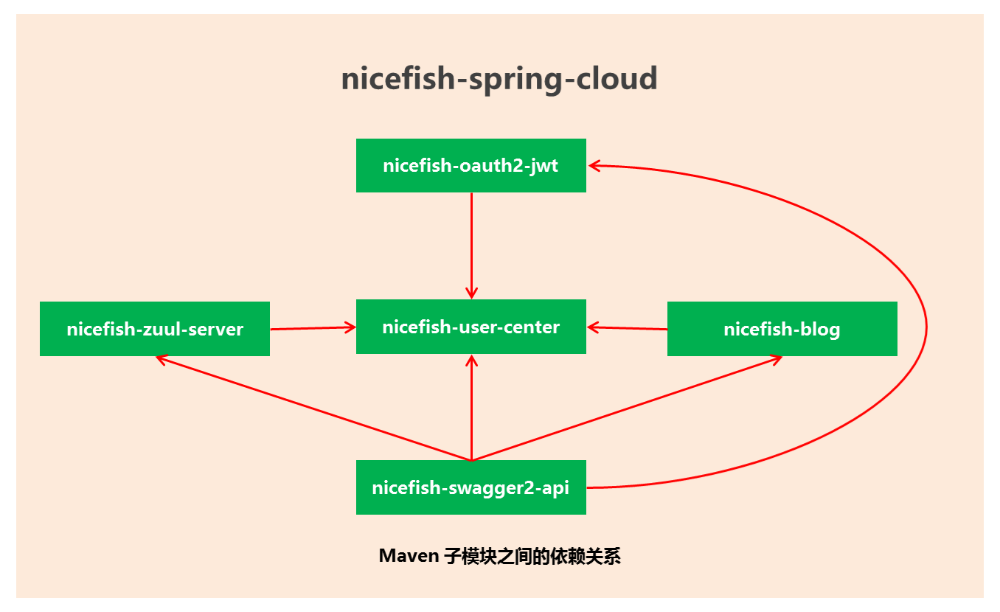
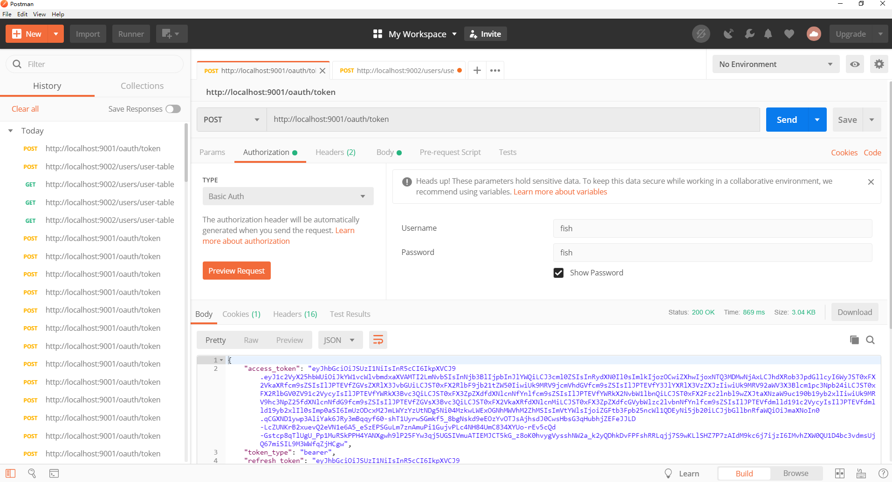
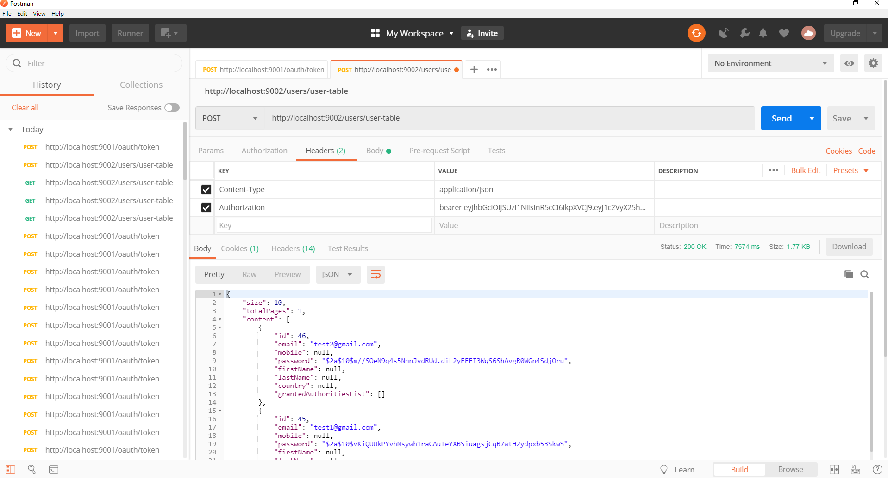
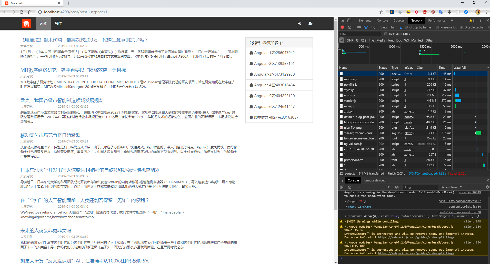
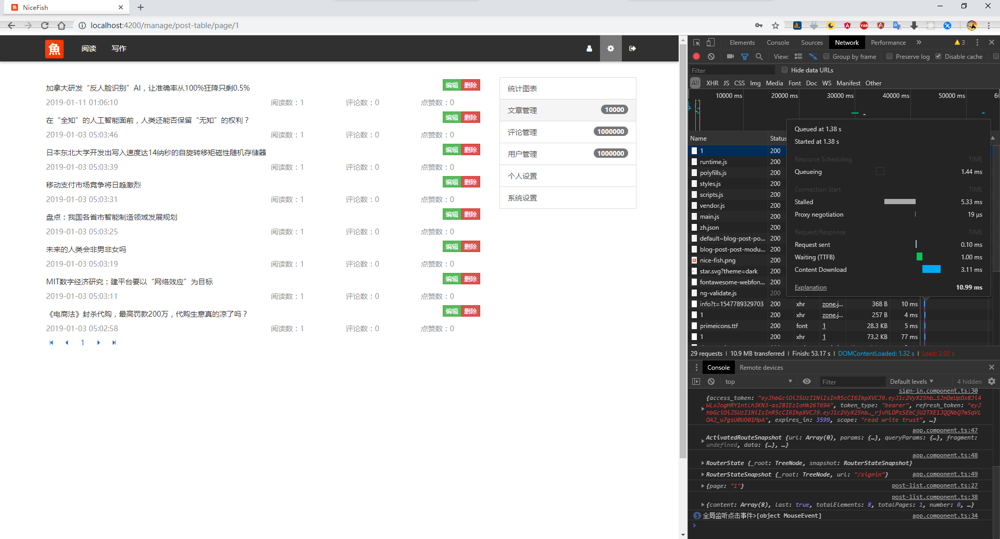
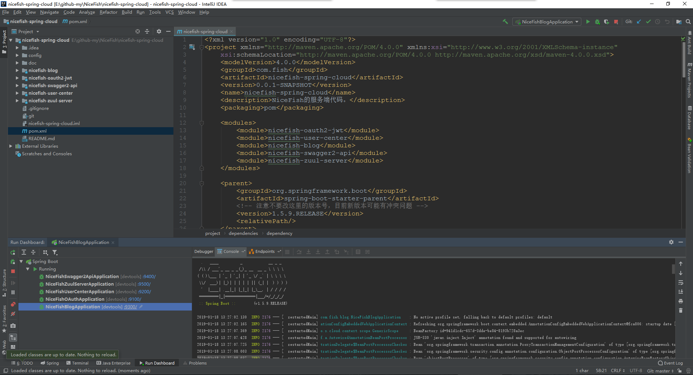
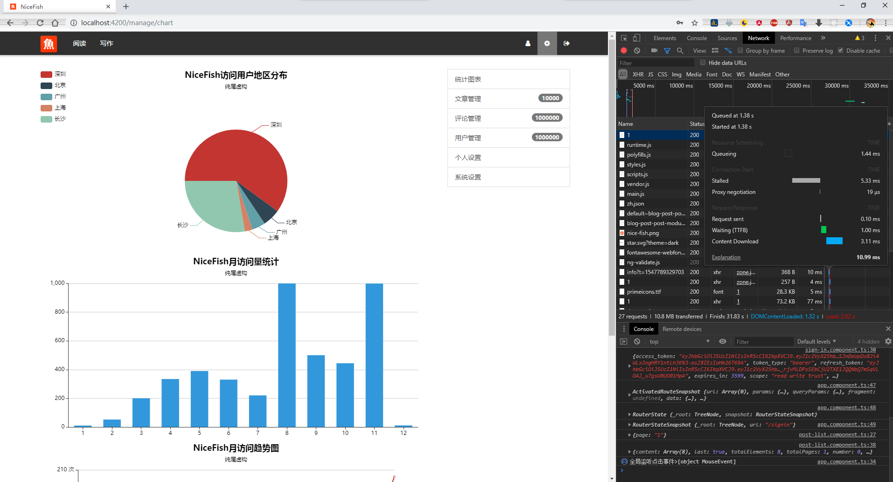

    

<h1 align="center">NiceFish</h1>

NiceFish（美人鱼） 是一个系列项目，目标是全面示范前后端分离的开发模式，前端浏览器、移动端、Electron 环境中的各种开发模式，后端采用基于 SpringCloud 的微服务实现。

## NiceFish-Spring-Cloud

本项目是NiceFish的服务端代码，已经实现的技术特性和业务功能有：

- 用Consul进行服务注册和发现
- 用Zuul对外暴露统一的REST服务入口
- 用HystrixDashboard监控微服务的调用，用Turbine整合数据图表
- 用SpringSecurity+OAuth2+JWT实现SSO
- 用Druid监控MySQL
- 集成lombok，用注解的方式调用日志服务
- 文章管理（列表分页查询、新增文章）
- 评论管理（列表分页查询）
- 用户管理（注册、登录、SSO）

用到的主要模块：
- spring-cloud-starter-consul-discovery
- spring-cloud-starter-zuul
- spring-cloud-starter-netflix-hystrix-dashboard
- spring-cloud-oauth2
- spring-boot-starter-data-jpa
- mysql-connector-java
- springfox-swagger2
- druid-spring-boot-starter
- lombok
- gson

## Maven Module 模块功能和依赖关系

    

Maven 模块之间的依赖关系

    

- nicefish-spring-cloud：这是root项目，通用的依赖都定义在这个项目的pom.xml中，子Module会自动继承这里的依赖关系。
- nicefish-zuul-server：这是所有外部调用的总入口，Zuul会自动到Consul上获取所有RestAPI，依赖nicefish-user-center模块中的配置和UserEntity等。Zuul内部已经使用了Ribbon和Hystrix，因此不需要单独在pom.xml中引入这两个模块，直接配置即可，默认访问路径是：http://localhost:9500/hystrix
- nicefish-user-center：这是用户中心模块，它是独立的不依赖其它子模块。
- nicefish-blog：这里实现blog相关的功能，如文章和评论等，依赖nicefish-user-center模块中的配置和UserEntity等。
- nicefish-oauth2-jwt：这里实现OAuth和JWT相关的功能，依赖nicefish-user-center模块中的UserEntity和Repository等。
- nicefish-swagger2-api：这里是所有API文档的总入口，依赖nicefish-user-center、nicefish-blog、nicefish-oauth2-jwt模块，解析并生成API文档，访问地址是 http://localhost:9004/swagger-ui.html#/
- Druid 监控访问路径：http://127.0.0.1:9500/druid/index.html ，默认用户名和密码admin/123456

## 使用方法

- 安装配置好JDK，需要Java 1.8以上版本。
- 安装配置好maven，或者使用IDEA内置的maven。
- 安装配置好Consul（默认HTTP端口是8500），以dev的方式启动agent（命令行执行consul agent -dev），请仔细参照官方文档：https://www.consul.io/ 。
- 克隆项目到你的本地：git clone https://gitee.com/mumu-osc/nicefish-spring-cloud.git 。
- 安装配置好MySQL或者MariaDB，MySQL需要5.x以上，MariaDB需要10.x以上。
- 在你本地的MySQL里面建一个库，名为nicefish，然后执行 /doc/nicefish.sql 建表。
- 用IDEA导入根项目nicefish-spring-cloud的pom.xml 。
- 启动所有子模块（有顺序）：NiceFishOAuthApplication.java、NiceFishUserCenterApplication.java、NiceFishBlogApplication.java、NiceFishZuulServerApplication.java 。
- 使用Postman或者NiceFish的前端项目来测试Restful接口（Zuul网关默认起在9500端口、OAuth服务默认起在9100端口，用户中心模块默认起在9200端口，blog相关的模块默认起在9300端口，Swagger2文档服务默认起在9400端口，内置了一个测试账号damoqiongqiu@126.com，密码12345678，密码对应的MD5是25d55ad283aa400af464c76d713c07ad） 。
- 前端代码：https://gitee.com/mumu-osc/NiceFish ，NiceFish与本项目对接的代码位于for-spring-cloud分支上,里面有完整的使用说明，请仔细阅读Readme文档。

## 特别注意

- **此项目在 SpringBoot 1.5.9.RELEASE 和 SpringCloud Edgware.RELEASE 测试通过，其它所有版本都未经测试。（SpringBoot和SpringCloud之间存在版本对应关系，版本升级可能需要修改非常多的琐碎细节。如果您需要升级版本，请仔细查阅Spring官方的文档，以免浪费大量时间。）**
- **项目本身的代码是独立的，没有与任何前端技术绑定，因此您可以使用任意前端技术接入。**

## 效果截图

## 系列项目

* NiceFish：美人鱼，这是一个微型 Blog 系统，前端基于 Angular 7.0 + PrimeNG 7.0.3。http://git.oschina.net/mumu-osc/NiceFish/

* nicefish-ionic：这是一个移动端的 demo，基于 ionic，此项目已支持 PWA。http://git.oschina.net/mumu-osc/nicefish-ionic

* NiceBlogElectron：https://github.com/damoqiongqiu/NiceBlogElectron ,这是一个基于 Electron 的桌面端项目，把 NiceFish 用 Electron 打包成了一个桌面端运行的程序。这是由 ZTE 中兴通讯的前端道友提供的，我 fork 了一个，有几个 node 模块的版本号老要改，如果您正在研究如何利用 Electron 开发桌面端应用，请参考这个项目。

* nicefish-spring-cloud: https://gitee.com/mumu-osc/nicefish-spring-cloud ， 这是NiceFish的服务端代码，基于SpringCloud。已经完成了一些基本的功能，如 SpringSecurity+OAuth2+JWT 实现SSO，文章、用户、评论等的分页查询等。如果你需要与这个后端代码进行对接，请检出本项目的 for-spring-cloud 分支。

## 关联 QQ 群

## License

MIT